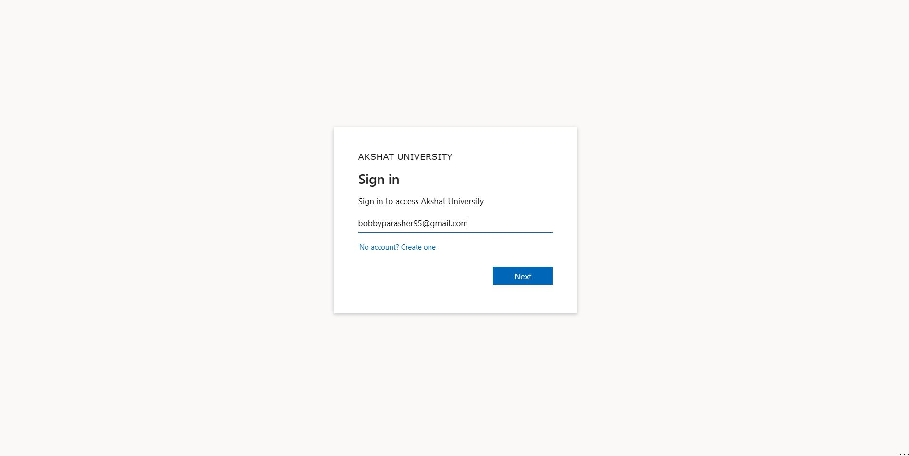
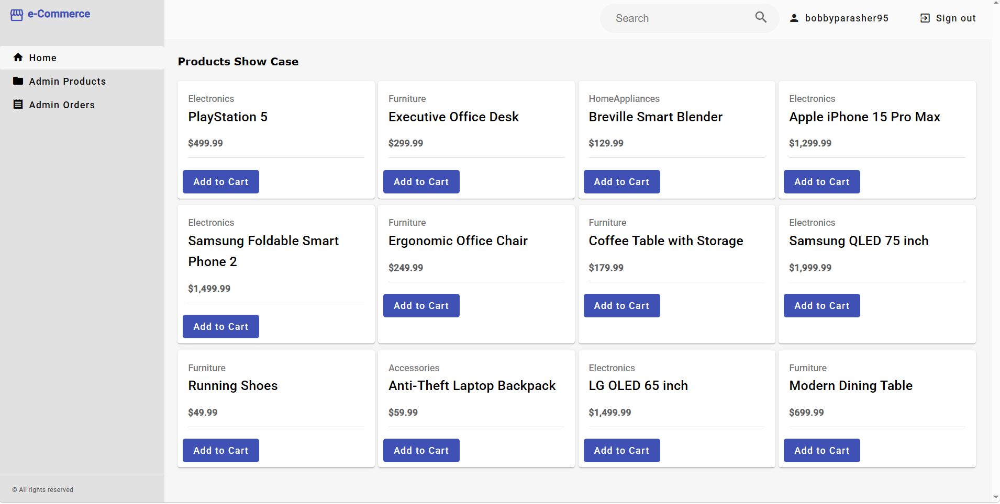
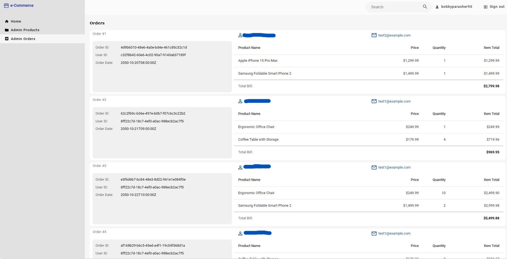
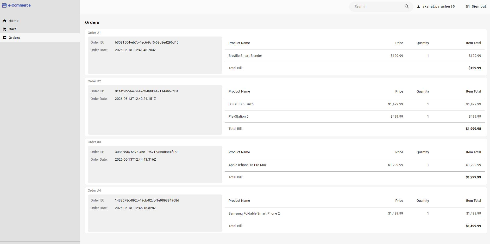
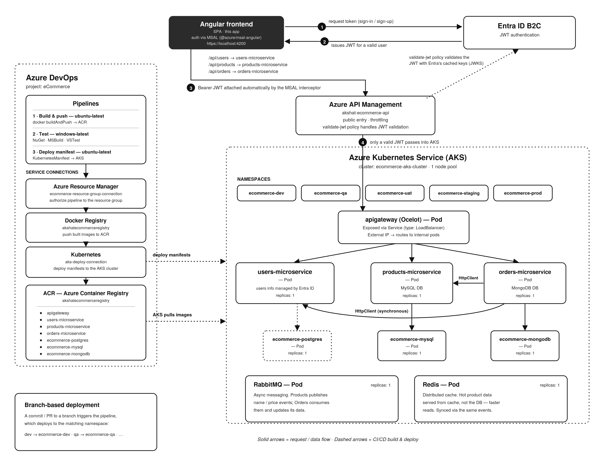

# eCommerce Frontend — Angular SPA

Angular 17 single-page application for a distributed eCommerce platform. This is the
frontend layer of a .NET microservices system, communicating with backend services
through an Ocelot API Gateway.

## 📝 Note for Reviewers

[!IMPORTANT]
> This is a **cost-optimized learning deployment**. The databases run as **ephemeral pods with no persistent storage attached**, and the AKS cluster is shut down outside of demo hours to keep Azure costs near zero.

**What this means in practice:**
- **Data does not persist.** Products, users, and orders you create live only inside the pod's container filesystem.
- **State resets** whenever the cluster is turned off, or when pods are recreated (which happens on every restart — effectively a daily reset).
- Each pod comes back **fresh and empty**.
- If you revisit the app the next day, expect a **clean slate** — this is intentional, not a bug.

In a production setup, durability would come from **managed databases** (e.g., Azure Database for MySQL, Azure Cosmos DB) or **PersistentVolumes / StatefulSets** backed by Azure Disks, so data would survive restarts. That's deliberately left out here to keep the project free to host while still demonstrating the full CI/CD → AKS pipeline.

## Architecture

The following diagrams illustrate the architecture of the microservices:

### Users microservice
Authentication is handled by **Microsoft Entra External ID**.


### Products microservice


### Orders microservice

### User orders


This frontend is part of a larger microservices ecosystem:



## Tech Stack

Angular 17 · TypeScript · RxJS · Reactive Forms · CSS

## Getting Started

You can use **PowerShell** or the **VS Code integrated terminal** (`` Ctrl+` `` to open it in VS Code). From the project root, run:

```bash
npm install
ng serve --ssl
```
**Note:** `--ssl` serves the app over HTTPS with a self-signed certificate, so your browser may show a security warning on first run — this is expected for local development. HTTPS is required here because Entra ID (MSAL) authentication needs a secure origin for the redirect flow.

App runs at `https://localhost:4200`.

### Backend requirement

The AKS cluster must be running with the backend services deployed (users, products, and orders microservices, the API gateway, and their databases) for the app to function. The frontend calls those services through Azure API Management, so requests will fail if the cluster or services are not up.

## Learning Project

Built while working through ".NET Microservices with Azure DevOps & AKS | Basic to Master"(https://www.udemy.com/course/dot-net-microservices-ecommerce-project-azure-devops-kubernetes-aks/learn/lecture/45853823?start=1#overview) by Harsha Vardhan on Udemy.

## 👨‍💻 Author

**Akshat Parasher** — Software Engineer | C#/.NET Developer | Germany 🇩🇪

- 🔗 [Portfolio](https://akshat95-portfolio.netlify.app)
- 🔗 [GitHub](https://github.com/AkshatAspNetCore)
- 🔗 [GitLab](https://gitlab.com/arkhamknight95-group)

---

Part of a portfolio project demonstrating .NET microservices with an Angular frontend.
