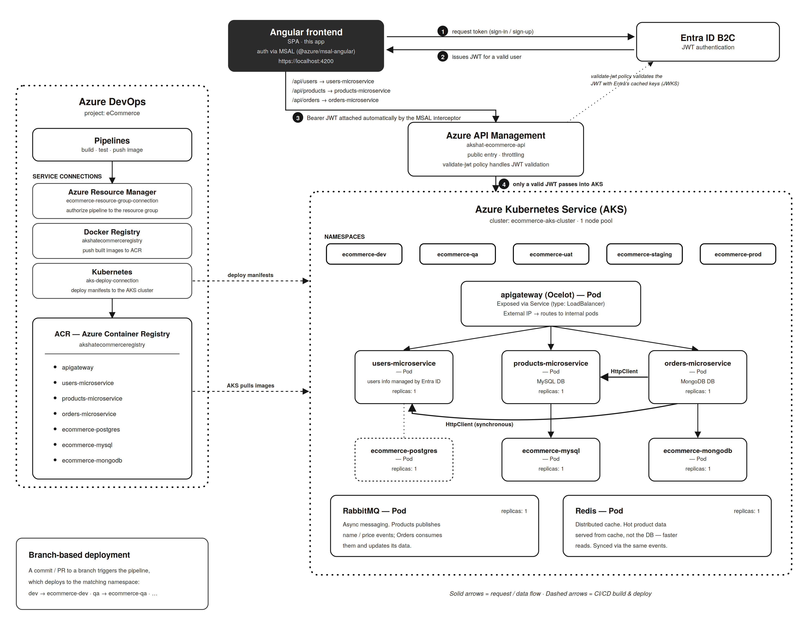

# eCommerce Frontend — Angular SPA

Angular 17 single-page application for a distributed eCommerce platform. This is the
frontend layer of a .NET microservices system, communicating with backend services
through an Ocelot API Gateway.

## Architecture

The following diagrams illustrate the architecture of the microservices:

### Products microservice


### Orders microservice


### Users microservice
Authentication is handled by **Microsoft Entra External ID**.

This frontend is part of a larger microservices ecosystem:



## Tech Stack

Angular 17 · TypeScript · RxJS · Reactive Forms · CSS

## Getting Started

```bash
npm install
ng serve
```

App runs at `http://localhost:4200`.

The backend stack must be running for the app to function. Backend services
run via Docker Compose from separate repositories.

## Learning Project

Built while working through ".NET Microservices with Azure DevOps & AKS | Basic to Master"(https://www.udemy.com/course/dot-net-microservices-ecommerce-project-azure-devops-kubernetes-aks/learn/lecture/45853823?start=1#overview) by Harsha Vardhan on Udemy.

## Build

```bash
ng build --configuration=production
```

Output goes to `dist/`. Deployable to any static host.

---

Part of a portfolio project demonstrating .NET microservices with an Angular frontend.
